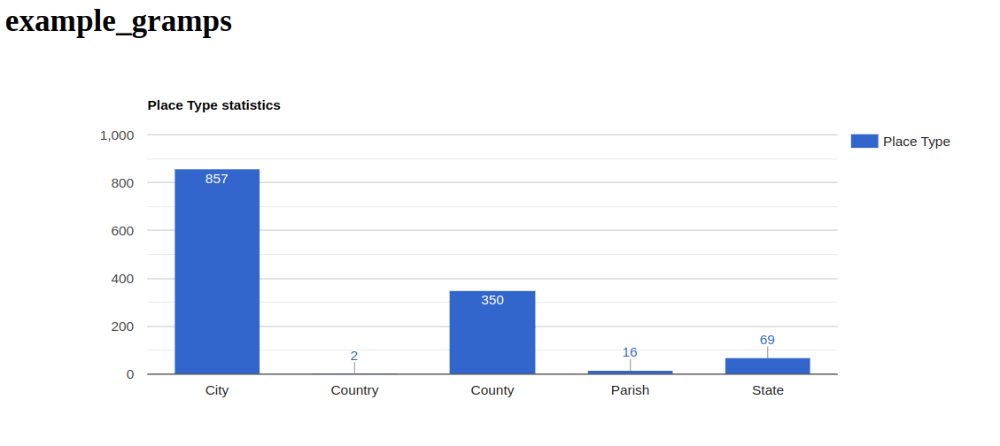
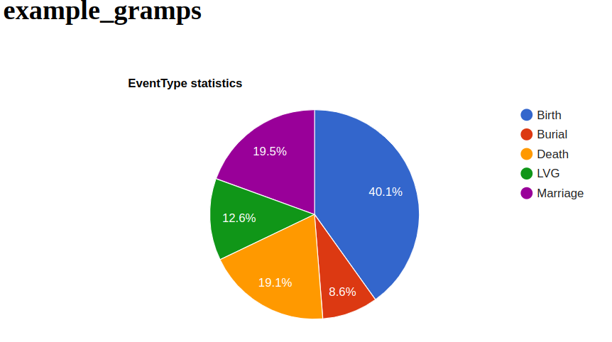
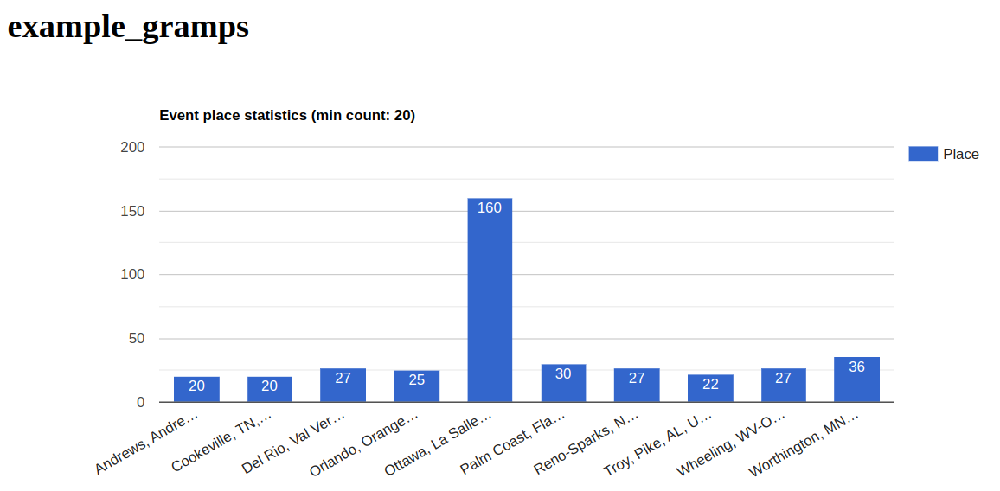
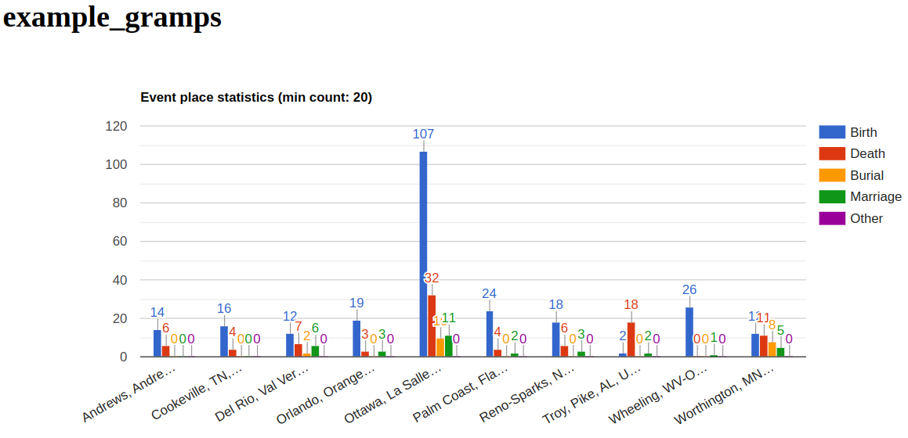
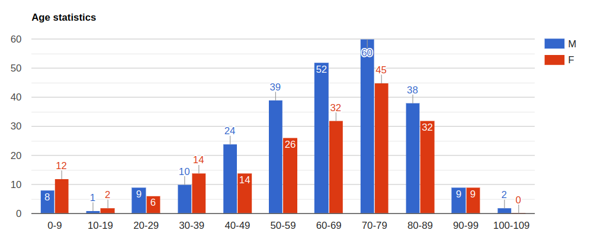
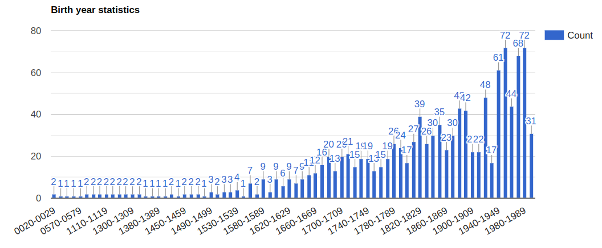

Charts
------

Author: kari.kujansuu@gmail.com 
2025

Here are some sample scripts that can generate charts using the Google chart tools (e.g. https://developers.google.com/chart/interactive/docs/gallery/barchart). These can be used to display some statistics of a Gramps family tree.

Load a script into SuperTool, possibly adjust some parameters in the "Initialization statements" section and press Execute. The script generates a temporary HTML file with Javascript code that draws the chart. The script then invokes a web browser to display the chart. 

### Implementation details

The scripts use the auxiliary code in <code>chart.py</code>. There is the function <code>drawgraph</code>. The function should be called with the arguments:

    1. Header for the page. The examples use the database name.
    2. Title of the graph
    3. List of column names.
    4. The data to be displayed. A list of tuples (or lists). The tuples are (itemlabel, colvalue1, colvalue2, ...).
    5. The type of the chart. Default "ColumnChart". Possible values are at least "ColumnChart", "BarChart", "PieChart" and "LineChart".

***

### Place Types

https://github.com/kkujansuu/supertool-scripts/blob/main/charts/placetype-statistics-graph.script

Simple column chart that shows which place types are used. This should be run in the Places category. The result could be like:

***

### Event Types

https://github.com/kkujansuu/supertool-scripts/blob/main/charts/eventtype-statistics-graph.script

A pie chart that shows which event types are used. This should be run in the Events category. The result could be like:

***

### Event Places

https://github.com/kkujansuu/supertool-scripts/blob/main/charts/event-place-statistics-graph.script

Simple chart that shows the most common places used in events. This should be run in the Events category.

Note that the parameter MIN_COUNT excludes places
that appear in fewer than 20 events. The result could be like:

Apparently Ottawa is the most common place. You might be interested to see the types of events. Here is a slightly
enhanced script:

https://github.com/kkujansuu/supertool-scripts/blob/main/charts/event-place-statistics-graph2.script

which gives:

### Age statistics

https://github.com/kkujansuu/supertool-scripts/blob/main/charts/age-statistics-graph.script

Number of deaths by age and by gender. This should be run in the People category.

### Birth years

https://github.com/kkujansuu/supertool-scripts/blob/main/charts/birth-year-statistics-graph.script

Number of people birth year. This should be run in the People category.

