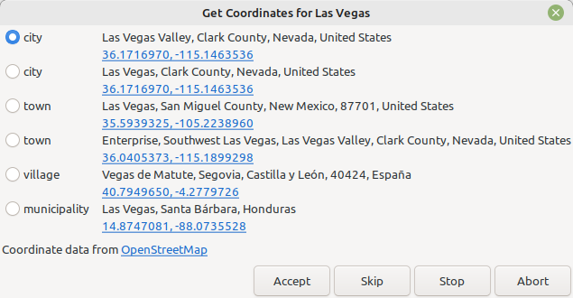

Get Coordinates
---------------

Author: kari.kujansuu@gmail.com 
2025

Fetches coordinates for places from the OpenStreetmap service.

Open the script in the Places view. Select one or more places and press Execute. The script will show a dialog for each selected place, like this:

Use the radio buttons to select a correct alternative. Press

* **Accept** to store the coordinates for the current place
* **Skip** to skip this place and continue for the next
* **Stop** to stop the operation but keep the already retrieved coordinates
* **Abort** to stop the operation and discard all coordinates fetched during this run

Clicking the coordinates links in the dialog will open the corresponding OpenStreetMap map page in a browser.

Note that the Place Cleanup gramplet (https://gramps-project.org/wiki/index.php/Addon:PlaceCleanupGramplet) contains a similar functionality. The Place Cleanup also has many more features.

