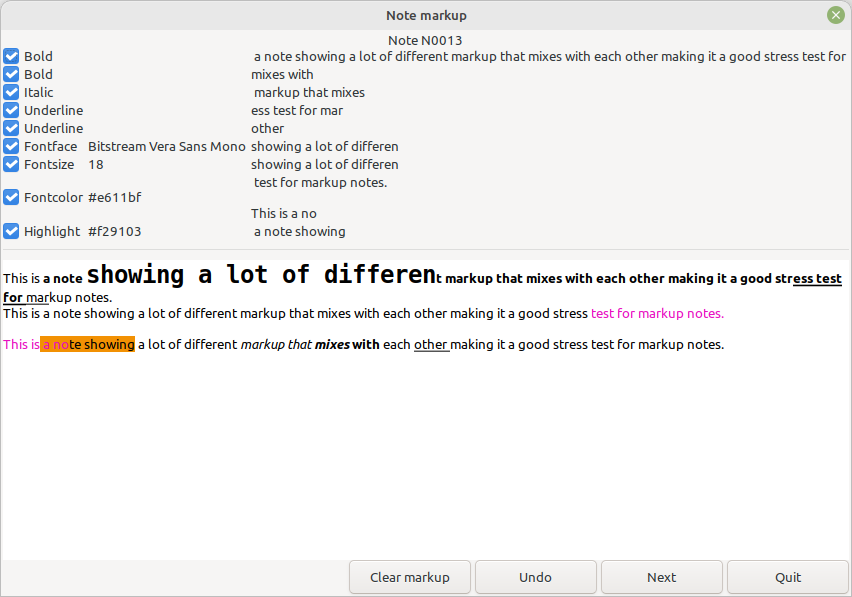

Note Markup
-----------

Kari Kujansuu

19 Feb 2025

This is a quick-and-dirty SuperTool script that can remove selected markup from Notes.

Go to the Notes view and select one or more notes. Invoke Supertool and load this script. Press Execute. The script will go thru the selected notes one-by one and display the note as in the example below:

The current content of the note is displayed at the bottom part of the dialog.

At the top there are checkboxes for each markup in the note. By default all checkboxes are selected. Clicking the **Clear markup** button will remove selected markups from the note and display the new contents. **Undo** will restore the original markup. **Next** will go to the next selected note, if any. **Quit** will quit the operation completely, skipping rest of the selected notes.
