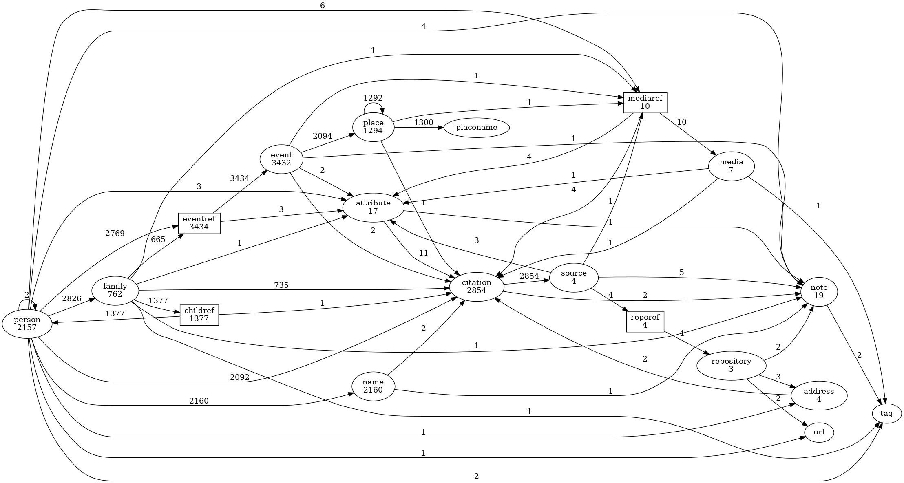

References
----------
Author: kari.kujansuu@gmail.com 
June 2025 

> This is a SuperTool script, see https://www.gramps-project.org/wiki/index.php/Addon:Isotammi_addons#SuperTool and https://github.com/Taapeli/isotammi-addons/tree/master/source/SuperTool.

The script generates an image (.png file) that shows the various objects and their relationships in the Gramps database/family tree.

For example, for the sample database the result looks like:

The ovals represent the object types. The numbers within ovals indicate the number of objects of that type. An arrow from an object to another indicates that there is at least one reference from an object of one type to an object of the other type. The number beside the arrow indicates the number of such references.

So for example, there are 2157 Person objects and they have 2769 references to an event. The events have 2094 references to place (so there are almost 1400 events that do not contain a place). 

The diagram includes the "Reference" objects (EventRef, ChildRef etc) that are "between" the referencing and referenced object. They are needed because they might also contain e.g. citations, notes or attributes. The reference object are displayed as rectangles.

I guess this kind of a graph may reveal points of improvement (e.g. only two events have citations in the above graph). Or the graph may just be interesting or fun.

### Notes

The image files use a temporary (random) name. They are created in a temporary directory. They will remain there until deleted by the operating system.

The script will open the image files automatically with the default image viewer.

The script can be run in any category. Use the Dashboard category to avoid a warning.
