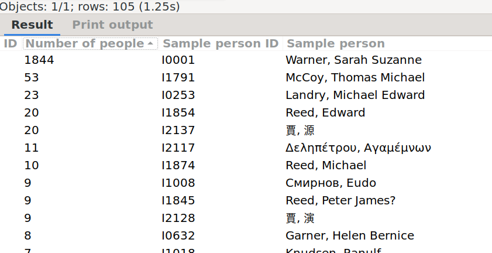

Subsets
-------
Author: kari.kujansuu@gmail.com 
November 2024 

This is a SuperTool script, see https://www.gramps-project.org/wiki/index.php/Addon:Isotammi_addons#SuperTool and https://github.com/Taapeli/isotammi-addons/tree/master/source/SuperTool.

### General

There may be "islands" in your family tree. Islands are groups of people linked to each other, but not linked to people in other islands.

This script will find these "islands". Technically these islands are called subsets or partitions.

The script will display the number of people in each subset and a sample person from each set. 

Double-clicking on a row will open the person editor for the sample person. 

The connectedness is defined by relationships: a person's parents, children and spouses belong to the same subsets. 

Run the script in the People view. The script always processes the complete database - it doesn't matter whether you choose "All objects", "Filtered objects" or "Selected objects".

### Example

For example, in the sample database the script finds 105 separate partitions. The largest one has 1844 individuals:

### Notes

The code is based on the “Not Related” tool (https://gramps-project.org/wiki/index.php/Gramps_5.2_Wiki_Manual_-_Tools#Not_Related).

The script chooses the sample person as the person with the alphabetically lowest ID in the subset.

As always with SuperTool, the rows can be sorted by clicking the column headers.

See e.g. the discussion here: https://gramps.discourse.group/t/list-of-tree-snippets/6425/7

