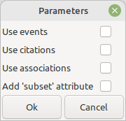
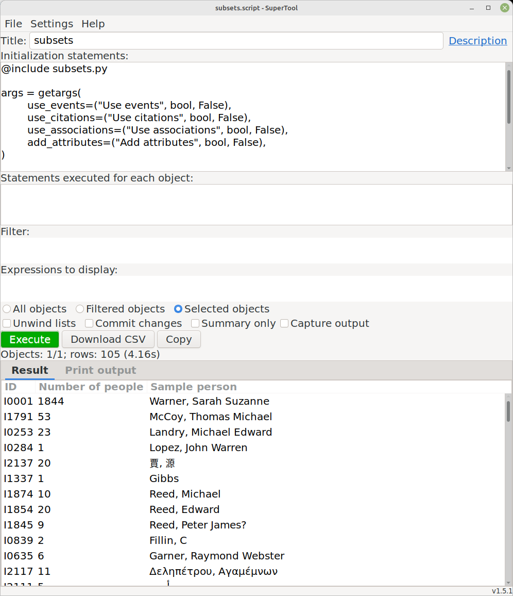
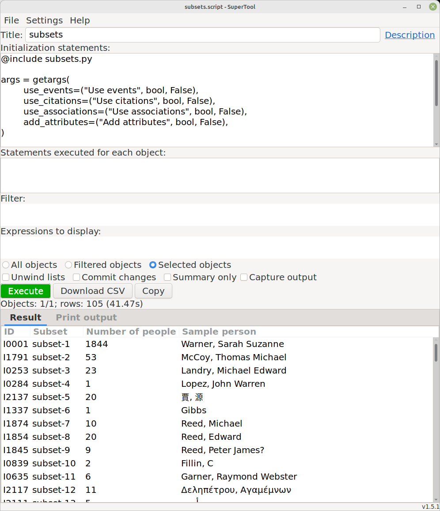
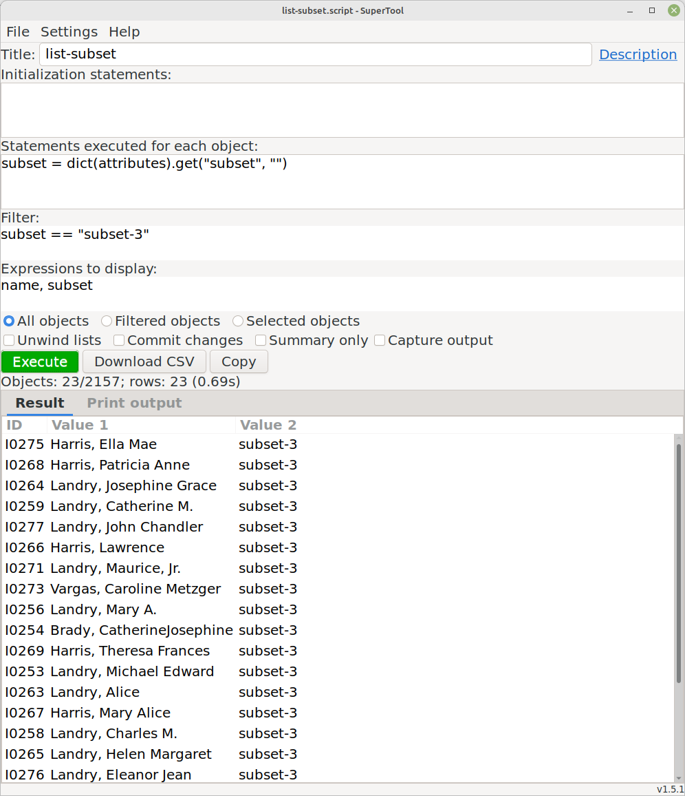
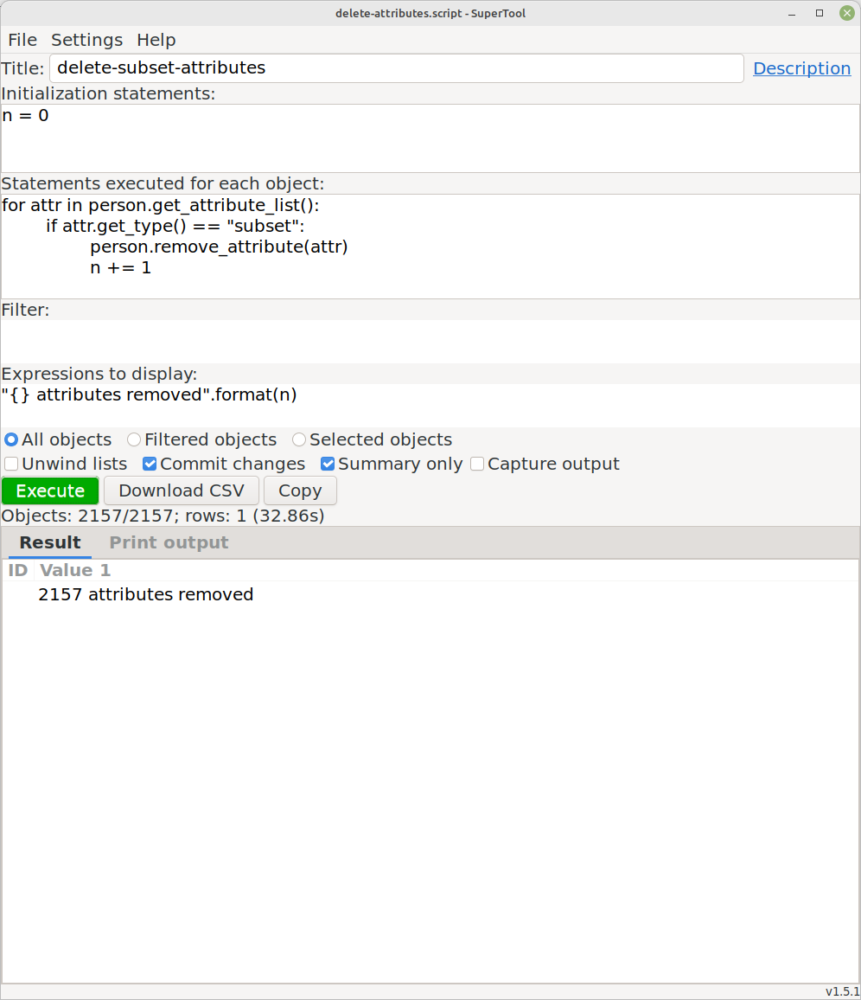

Subsets
-------
Author: kari.kujansuu@gmail.com 
November 2024 

This is a SuperTool script, see https://www.gramps-project.org/wiki/index.php/Addon:Isotammi_addons#SuperTool and https://github.com/Taapeli/isotammi-addons/tree/master/source/SuperTool.

### General

There may be "islands" in your family tree. Islands are groups of people linked to each other, but not linked to people in other islands.

This script will find these "islands". Technically these islands are called subsets or partitions.

The script will display the number of people in each subset and a sample person from each set. The sample person's ID is show in the first column.

Double-clicking on a row will open the person editor for the sample person. 

The script can be run in any view. The script always processes the complete database - it doesn't matter whether you choose "All objects", "Filtered objects" or "Selected objects".

The connectedness is by defined by relationships: a person's parents, children and spouses belong to the same subsets. But at startup the script allows the user also to choose the following options:

* **Use events** means that people are connected also if they are participants in the same event

* **Use citations** means that people are connected also if they have the same (direct) citation. Direct means that the citations should be added to the person objects - not to events, for example. 	

* **Use associations** means that there is an association from one person to the other

* **Add 'subset' attribute** means that the script will add an attribute named 'subset' for each person. The value of the attribute is the subset number (in format 'subset-123'). The subset numbers are assigned by the script and also displayed if this option is selected. See example below.

### Example

For example, in the sample database the script finds 105 separate partitions. The largest one has 1844 individuals:

### Example with subset numbers

If the **Add 'subset' attribute** is selected then the subset numbers are also displayed:

Note that setting the attributes can be quite slow.

### Listing people in a subset

You can list the individuals in a specific subset with the script 'list-subset':

The subset number should be set in the Filter section.

### Removing the subset attributes

You can remove the 'subset' attribute from all people with the script 'delete-subset-attributes':

### Notes

The code is based on the “Not Related” tool (https://gramps-project.org/wiki/index.php/Gramps_5.2_Wiki_Manual_-_Tools#Not_Related).

The script chooses the sample person as the person with the alphabetically lowest ID in the subset.

As always with SuperTool, the rows can be sorted by clicking the column headers.

See e.g. the discussion here: https://gramps.discourse.group/t/list-of-tree-snippets/6425/7

